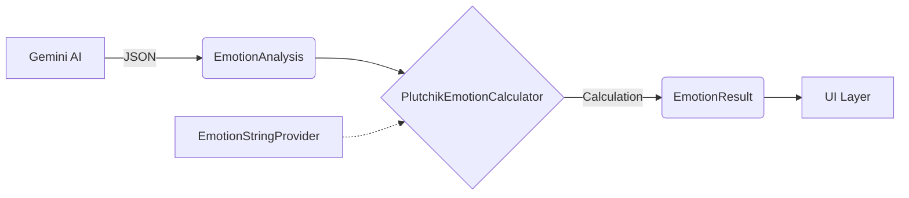
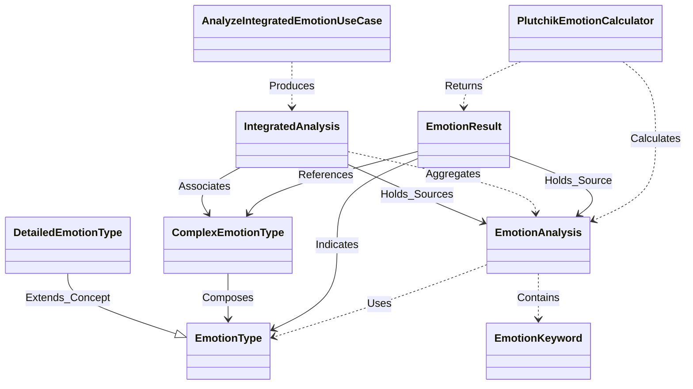

# Emotion Data Models Diagram
Minder 앱에서 사용하는 감정 데이터 모델의 계층 구조와 흐름을 정리한 문서입니다.

## 1. Overview (Data Flow)
Gemini AI로부터 받은 원시 데이터가 계산기를 거쳐 최종 사용자가 보는 결과로 변환되는 과정입니다.

---

## 2. Model Hierarchy

### Level 1: Primitives (기초)
가장 기본이 되는 8가지 원형 감정입니다.

#### `EmotionType` (enum)
Robert Plutchik의 감정 휠에 기반한 8가지 기본 감정입니다.
- `JOY` (기쁨)
- `TRUST` (신뢰)
- `FEAR` (두려움)
- `SURPRISE` (놀람)
- `SADNESS` (슬픔)
- `DISGUST` (혐오)
- `ANGER` (분노)
- `ANTICIPATION` (기대)

---

### Level 2: Input Data (1차 분석 데이터)
AI 분석을 통해 생성되는 원시 데이터(Raw Data)입니다.

#### `EmotionAnalysis` (data class)
8가지 감정 각각에 대한 0.0 ~ 1.0 사이의 실수형 점수(Intensity)를 가집니다.
- **Fields**:
    - `anger`, `joy`, `sadness` ... (Float): 각 감정의 점수
    - `keywords`: `List<EmotionKeyword>` (감정의 원인이 되는 키워드 리스트)
- **Functions**:
    - `getDominantEmotion()`: 가장 점수가 높은 감정 반환
    - `getEmotionIntensity(type)`: 특정 감정의 점수 반환

---

### Level 3: Classification Rules (분류 체계)
분석된 감정 점수를 해석하기 위한 정적(Static) 규칙들입니다.

#### A. `DetailedEmotionType` (enum)
단일 감정의 **강도(Intensity)**에 따른 분류입니다. (총 24개)
- **Levels**: Strong (3) / Medium (2) / Weak (1)
- **Example (JOY 계열)**:
    - Level 3: `ECSTASY` (황홀)
    - Level 2: `JOY` (기쁨)
    - Level 1: `SERENITY` (평온)

#### B. `ComplexEmotionType` (enum)
두 가지 감정의 **조합(Combination)**에 따른 분류입니다. (총 52개)
- **Structure**: `Pair<EmotionType, EmotionType>` 매핑
- **Categories**:
    1.  **Single Emotion** (`DetailedEmotionType`과 매핑)
    2.  **Primary Dyad** (1차 이중감정): 인접한 감정의 결합 (예: 기쁨 + 신뢰 = `LOVE` 사랑)
    3.  **Secondary Dyad** (2차 이중감정): 하나 건너뛴 감정 (예: 기쁨 + 두려움 = `GUILT` 죄책감)
    4.  **Tertiary Dyad** (3차 이중감정): 멀리 떨어진 감정 (예: 기쁨 + 놀람 = `DELIGHT` 환희)
    5.  **Opposite** (반대 감정): 정반대 감정의 충돌 (예: 기쁨 + 슬픔 = `BITTERSWEETNESS` 시원섭섭함)

---

### Level 4: Output Result (최종 분석 결과)
계산 로직(`PlutchikEmotionCalculator`)을 통해 도출되어 UI에 표시되는 최종 객체입니다.

#### `EmotionResult` (data class)
`EmotionAnalysis`를 입력받아, 가장 우세한 감정 2가지를 조합하여 생성됩니다.
**사용자의 제안을 반영하여, 분석의 근거가 된 원본 데이터(`EmotionAnalysis`)를 포함합니다.** 이를 통해 결과 객체만으로도 차트 그리기 등의 상세 시각화가 가능해집니다.

- **Defined in**: `PlutchikEmotionCalculator`
- **Fields**:
    - `label` (String): 최종 표시 이름 (예: "사랑", "낙관")
    - `description` (String): 감정 상태에 대한 상세 설명
    - `primaryEmotion` (EmotionType): 제1 우세 감정 (차트의 색상 결정)
    - `secondaryEmotion` (EmotionType?): 제2 우세 감정 (단일 감정일 경우 null)
    - `score` (Float): 해당 감정 조합의 계산된 강도
    - `category` (ComplexEmotionType.Category): 감정 결합의 종류 (Primary, Opposite 등)
    - `complexEmotionType` (ComplexEmotionType?): 매칭된 복합 감정 타입 상수
    - `source` (EmotionAnalysis): **[New]** 이 결과를 도출하는 데 사용된 원본 분석 데이터 (1:1 참조)

---

### Level 5: Aggregation & Insights (통합 분석)
여러 개의 분석 데이터(`EmotionAnalysis` list)를 종합하여 도출된 거시적인 결과입니다.

#### `IntegratedAnalysis` (data class)
`AnalyzeIntegratedEmotionUseCase`를 통해 생성되며, 기간별 또는 그룹별 감정 요약을 담당합니다.
**사용자의 제안을 반영하여, 통합 분석에 사용된 모든 원본 데이터 목록(`List<EmotionAnalysis>`)을 포함합니다.** 이를 통해 분포도 시각화나 드릴다운(Drill-down)이 가능해집니다.

- **Fields**:
  - `recentEmotions` (Map<EmotionType, Float>): 종합된 평균 감정 분포
  - `complexEmotionString` (String): 종합적으로 계산된 대표 복합 감정 이름 (e.g., "낙관")
  - `summary` (String): 상태 요약 및 설명
  - `suggestedAction` (String): 추천 행동/조언
  - `keywords` (List<EmotionKeyword>): **[Changed]** 통합된 주요 키워드 리스트 (기존 단순 문자열에서 변경). 빈도수나 점수가 높은 순으로 정렬.
  - `complexEmotionType` / `detailedEmotionType`: 분석된 감정 타입 상수
  - `sourceAnalyses` (List<EmotionAnalysis>): **[New]** 통합 분석에 사용된 원본 데이터 리스트 (1:N 참조)

---

## 3. Class Relationship Diagram

